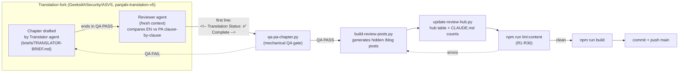

# Maintenance Handoff — AI-Assisted Publishing System

**Status:** living document. Update it whenever the maintenance system itself
changes — new lint rule, new frontmatter field, new pipeline step. This is
the doc a future session (or a human who hasn't touched this repo in months)
should read first to understand how content gets from idea to published page.

**Origin session:** this document, and the six gaps below, were written up in
[Claude session `018AXSV6NqHZuiaMd5Edptgc`](https://claude.ai/code/session_018AXSV6NqHZuiaMd5Edptgc).
If something here is unclear or seems to contradict the code, that session's
transcript is the place to check intent before assuming the doc is stale.

---

## 1. What already exists (read this before proposing something new)

The site already runs a lightweight, GitHub-native maintenance loop — not a
CMS, not a task board, just files in the repo:

| Piece | Where | What it does |
|---|---|---|
| Decision log | `work/decision-log/YYYY-MM-DD.md` | Plain-English notes written *during* work: what changed, why, what was skipped, "do not retry" dead ends. |
| Daily digest | `.claude/agents/decision-digest.md` → `outputs/daily-summary-YYYY-MM-DD.md` | Read-only sub-agent that rolls the day's log into a summary. Never makes decisions, only reports them. |
| Content lint | `scripts/lint-content.mjs` (rules `R1`–`R30`) | Build-time gate on every post/translation: required frontmatter, ISO dates, table shape, Devanagari contamination, `audio_url`↔file integrity (`R30`), `translation_status` validity (`R2`/`R3`/`R9`), etc. |
| ASVS/AISVS pipeline | `scripts/asvs/`, `scripts/aisvs/` | `qa-pa-chapter.py` (mechanical QA gate) → `build-review-posts.py` (generates hidden posts from the translation fork) → `update-review-hub.py` (hub table + `CLAUDE.md` counts) → `lint:content` → `build`. |
| Agent briefs | `scripts/asvs/briefs/TRANSLATOR-BRIEF.md`, `REVIEWER-BRIEF.md` | Standing prompts for the two-stage translate → fresh-context-review workflow. |
| Retired-project registry | `CLAUDE.md` → *Retired Projects* | Table of sibling codebases that are patched-and-shelved, so nobody "fixes" them again. |

This is functionally the same shape as Daniel Miessler's ULWork/LifeOS setup
(see §3), just smaller and without a task-board file — the decision log
already *is* the blackboard.

## 2. Six gaps identified, spelled out

These were flagged as missing pieces in the current system. Each entry gives
the concrete failure mode, not just the label.

### 2.1 Mermaid skill — the pipeline has no diagram anywhere

The ASVS/AISVS pipeline (translator → reviewer → QA gate → generator →
lint → build → publish) is described in prose across three places
(`scripts/asvs/README.md`, `CLAUDE.md`, and scattered decision-log entries)
and nowhere as a single picture. A new contributor — human or agent — has to
reconstruct the flow by reading three files.

**Fix:** Claude Code and GitHub both render Mermaid natively (fenced
` ```mermaid ` blocks — no library, no npm dependency, consistent with the
lean-deps policy). Diagram below is the canonical version; keep it in sync
with `scripts/asvs/README.md` when the pipeline changes.



### 2.2 Artifact logging — published Artifacts leave no trail

Claude Code sessions can publish Artifacts (dashboards, diagrams, drafts).
Nothing in this repo records that one exists once the session ends — the URL
lives only in that session's chat history, which the next session cannot
read.

**Fix (convention, effective immediately):** any decision-log entry that
involves publishing or updating an Artifact must record, inline:

```markdown
**Artifact published:** <title> — <url> — <one line on what it shows>
```

Example this doc's own session would have logged:

```markdown
**Artifact published:** none this session — output was repo files only
(docs/maintenance-handoff.md, CLAUDE.md pointer, this log entry).
```

Recording the *absence* of an artifact is as important as recording one —
it tells the next reader not to go hunting for a link that doesn't exist.

### 2.3 Curation gate enforcement — the QA gate is a convention, not a check

`scripts/asvs/README.md` states the rule: only fork files whose first line
is `<!-- Translation Status: ✅ Complete -->` should be published, and every
chapter needs a *second*, fresh-context reviewer pass before that marker is
trustworthy. But `build-review-posts.py` and `lint-content.mjs` have no way
to verify that either step actually happened — a chapter could be
regenerated from a fork file that was hand-edited back to "in progress," or
one that skipped the reviewer stage entirely, and the hidden post would
still build and pass lint. The gate exists in a README, not in code.

**Fix (spelled out for implementation, not yet built):**
1. `build-review-posts.py` refuses (non-zero exit) to generate a post from
   any fork file whose first line is not exactly
   `<!-- Translation Status: ✅ Complete -->` — currently it's assumed, not
   checked.
2. A new lint rule (next available ID after `R30`) fails the build if a
   hidden `asvs-panjabi-review-*` / `aisvs-panjabi-review-*` post's
   frontmatter lacks the traceability fields from §2.4 below — i.e., a post
   that exists without recorded QA evidence is a lint error, not a silent
   gap.
3. Same "fail fast, fail loud" principle CLAUDE.md already mandates
   elsewhere (§ Troubleshooting Discipline) — applied to curation, not just
   code.

### 2.4 Frontmatter traceability — provenance lives in the wrong place

Every ASVS review post cites its source inline, in the post body:

```markdown
> **Source:** OWASP ASVS [PR #3254](https://github.com/OWASP/ASVS/pull/3254) · this is faithful to the official pull request.
```

That's readable by a human but invisible to tooling — `lint-content.mjs`
can't check it, `update-review-hub.py` can't query it, and a future script
that wants "every post sourced from PR #3254" has to grep markdown bodies.
This is the opposite of Miessler's frontmatter-as-database pattern (§3):
his scripts write issue numbers straight into YAML so state lives in one
machine-readable place.

**Fix (spelled out, not yet built):** add to ASVS/AISVS review post
frontmatter:

```yaml
source_pr: "https://github.com/OWASP/ASVS/pull/3254"
qa_status: "reviewer_pass"   # translator_pass | reviewer_pass | published
```

`build-review-posts.py` sets these automatically from the fork file it
generates from (the fork file already knows its own PR — it's in the
translator brief) — no new manual step, so this doesn't add friction, it
moves an existing fact to a queryable place. The inline `> **Source:**`
line stays for human readers; frontmatter is additive, not a replacement.

### 2.5 Retire flagging — CLAUDE.md tracks retired *code*, not retired *content*

The *Retired Projects* table (CLAUDE.md, bottom) exists so nobody re-opens
a shelved sibling codebase. There is no equivalent for content: a blog post
or research article that references a since-changed CVE, a scam pattern
that's no longer current, or a superseded tool recommendation has no flag
distinguishing "still accurate" from "known stale, kept for the record."
Readers — and future editing sessions — can't tell the difference.

**Fix (spelled out, not yet built):** frontmatter field, checked by lint:

```yaml
retired: true
retired_date: "2026-09-05"
retired_reason: "CVE remediated upstream; post kept for historical record."
```

- `getPublicPosts()` (`src/lib/posts.ts`) excludes `retired: true` from
  `/blog` and the homepage the same way it already excludes `hidden: true` —
  same mechanism, different meaning: `hidden` is "not ready yet,"
  `retired` is "was ready, no longer current."
- A new lint rule requires `retired_reason` whenever `retired: true` is set
  (mirrors `R9`'s existing pattern: `ai_draft` requires a feedback contact,
  so `retired` requires a reason — no unexplained flags).
- Add a **Retired Content** section to `CLAUDE.md`, parallel to *Retired
  Projects*, once the first post is actually retired.

### 2.6 Maintenance continuity — which Claude session to check

When a future session hits something in this system that doesn't match its
description, there needs to be a pointer to *where this was decided*, not
just *that* it was decided. That's the origin-session link at the top of
this doc, and it should become standard practice: any doc that specifies
non-obvious system behavior (this one, `scripts/asvs/README.md`, the R30
rule's rationale) names the session that designed it, the same way commits
already carry `Claude-Session:` trailers. The decision log is the detailed
trail; this pointer is the fast path when the log entry has scrolled past
what's easy to re-read.

## 3. Ideas borrowed from Daniel Miessler's ULWork / LifeOS — and why most aren't adopted wholesale

Miessler's stack (ULWork blackboard file, LifeOS hooks, Fabric Patterns,
TELOS, Substrate) was reviewed for ideas applicable here. What maps, what
doesn't, and why:

| Miessler's piece | Maps to, in this repo | Adopt as-is? |
|---|---|---|
| `TASKLIST.md` blackboard | `work/decision-log/YYYY-MM-DD.md` | No new file needed — the decision log already is a shared, on-disk, human-and-agent-readable workspace. A separate task file would be a second source of truth to keep in sync, which CLAUDE.md's "no parallel data formats" rule argues against. |
| LifeOS "Hooks" (event-driven capture) | `.claude/agents/decision-digest.md` (end-of-day, not event-driven) | Partially — the digest sub-agent is the same idea (automatic capture of session output) but batched, not per-event. Per-event hooks would need a Claude Code `SessionEnd`/`Stop` hook writing to the decision log automatically; worth a future proposal, not built here (see `session-start-hook` skill for the mechanism if pursued). |
| GitHub Issues as a lightweight CMS, issue numbers written into frontmatter | §2.4 (frontmatter traceability), applied to PR numbers instead of Issues | Partially — this repo has zero open GitHub Issues today (checked 2026-09-05); the *pattern* (put the tracking reference in frontmatter, not prose) is worth adopting now, via `source_pr` (§2.4), without standing up an Issues-as-CMS workflow that has no content to track yet. |
| Fabric's markdown "Patterns" (crowdsourced prompts) | `scripts/asvs/briefs/TRANSLATOR-BRIEF.md` / `REVIEWER-BRIEF.md` | Already equivalent in spirit — standing, versioned, markdown prompt files for a repeatable task. Not renamed or restructured; the existing two-brief shape fits this site's narrower need (one pipeline, not 200 general-purpose patterns). |
| TELOS (personal context/voice framework) | `CLAUDE.md` itself + the `brand-voice` skill | Already covered — CLAUDE.md is this project's single source of truth for conventions, and the `brand-voice` skill carries author voice. No separate TELOS repo needed at this scale. |
| Substrate (shared knowledge graph for claims/data) | Nothing yet | Not adopted — this site's content volume (62 pages) doesn't justify a knowledge-graph layer. Revisit only if research articles start needing to cross-reference claims/data at a scale where grep-through-markdown breaks down. |

**Bottom line:** the underlying philosophy — plain Markdown, GitHub as the
system of record, automation that captures rather than replaces human
decisions — was already this repo's approach before this review. The six
gaps in §2 are the concrete places where that philosophy isn't fully
enforced yet (conventions that should be lint rules, provenance that's in
prose instead of frontmatter, published artifacts with no trail).

## 4. Next actions

Nothing in §2.3–§2.5 is implemented yet — they're specified here so a
future session can build them without re-deriving the reasoning. Suggested
order (each is independently shippable):

1. §2.4 (frontmatter traceability) — lowest risk, additive fields only,
   unblocks §2.3.
2. §2.3 (curation gate enforcement) — depends on §2.4's fields existing to
   check against.
3. §2.5 (retire flagging) — independent of the other two; do whenever the
   first post actually needs retiring.
4. §2.2 (artifact logging) is a convention, not code — effective now, no
   build step required.
5. §2.1 (Mermaid diagram) — done in this doc; re-sync it if the pipeline
   script order changes.
